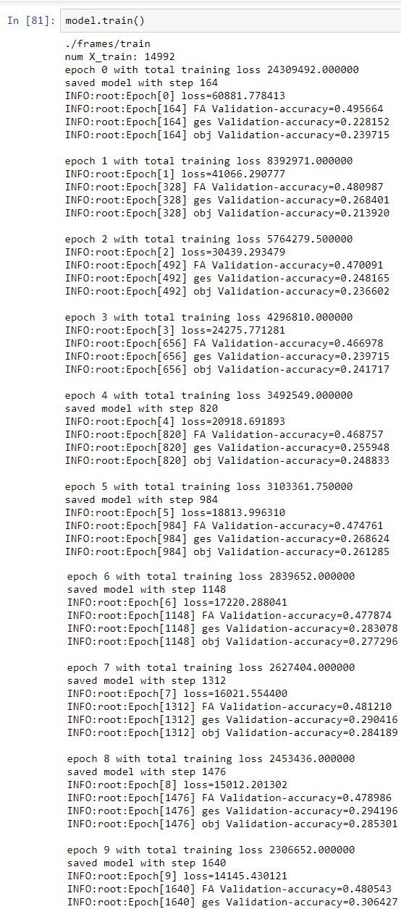
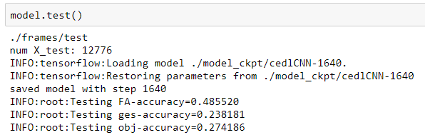

# 朱欣祈 106062510


## Overview
The project is related to 
> Deep convolutional neural network
> Gesture state and recognition

## Implementation
1. Preprocessing
	* The resolution of input images is too large that is unnecessary, so I reduce the frame size 128 * 64
	* Convert labels from integers to one-hot vectors
    * Dataset API : use tensorflow dataset iterator to load data
2. Model architecture
    * Input images
    * Four layers of CNN(with pooling layers and batch norm layers)
    * One dense layer after convolutional layers 
    * and for each prediction goal (FA, gesture, object), apply one fully connected layers respectively
    
    * use Adam optimizer for weight updating, softmax cross entropy for loss calculation
    * This model is more like a cnn encoder with multimodal classifier based on AlexNet architecture
3. hyperparameters
    * batch size = 64
    * number of training epoch = 10
    * initial learning rate = 0.0001

4. Evaluation metrics
    * accuracy of fa = accuracy for prediction of hand free/active state
    * accuracy of ges = accuracy for prediction of hand gesture classification
    * accuracy of obj = accuracy for prediction of object detection
    * loss = loss_fa*2 + loss_ges*13 + loss_obj*24, which is proportional to the class numbers

```
Code highlights
```
### part of cnn layers
```python
    with tf.variable_scope('conv1') as scope:
    kernel = tf.get_variable('weights', initializer=tf.truncated_normal(shape=[3, 3, 3, 16]))
    conv = tf.nn.conv2d(self.img, kernel, [1, 1, 1, 1], padding='SAME')
    biases = tf.get_variable('biases', [kernel.shape[-1]], initializer=tf.constant_initializer(0.1))
    pre_activation = tf.nn.bias_add(conv, biases)
    conv = tf.nn.relu(pre_activation, name=scope.name)

    # pool1
    pool = tf.nn.max_pool(conv, ksize=[1, 2, 2, 1], strides=[1, 2, 2, 1], padding='SAME', name='pool')
    # norm1
    norm = tf.nn.lrn(pool, 4, bias=1.0, alpha=0.001 / 9.0, beta=0.75, name='norm')

```

### loss and training operations
```python
self.loss = cross_entropy_mean_FA*2 + cross_entropy_mean_ges*13 + cross_entropy_mean_obj*24
        
self.global_step = tf.Variable(0, name="global_step", trainable=False)

optimizer = tf.train.AdamOptimizer(self.hps.lr)
grads_and_vars = optimizer.compute_gradients(self.loss)
self.train_op = optimizer.apply_gradients(grads_and_vars, global_step=self.global_step)
```
### training logs

### testing result

The result is not satisfying since the training time is not very long.
However, the prediction of gestures and object is much more accurate than random guessing.

## Installation
* Require jupyter notebook platform
* open the notebook and run model initialization and model.test()
* frames folder and labels folder (datasets) should under folder same as CNN.ipynb
* testing accuracy can run 


