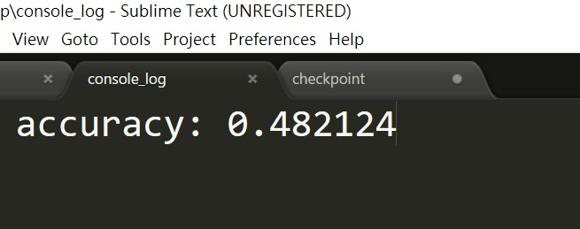

# 何品萱 (106062553)

#Project 1: Deep Classification

## Overview
The project is related to 
> classifying the hand states(object categories) by implementing VGG model network

## Implementation
1. finetuning a VGG model (homework1.py)
	* load images and labels
	* create `VGG16` model (pretrained on ImageNet)
	* Preprocessing for training
        * remove the last fully connected layer (fc8) and replace it with new
	* define the session and run
	* Check accuracy
2. testing.py
	* evaluate test data accuracy
	* restore model

## Installation
* Other required packages.
* How to compile from source?
Tensorflow
Tensorflow.contrib.slim
numpy
os

Download the weights trained on ImageNet for VGG:
http://download.tensorflow.org/models/vgg_16_2016_08_28.tar.gz

### Results

<table border=1>
<tr>
<td>

</td>
</tr>

</table>

