# Your Name 楊皓鈞<span style="color:red">(105061523)</span>

#Project 1: Deep Classification


<center>
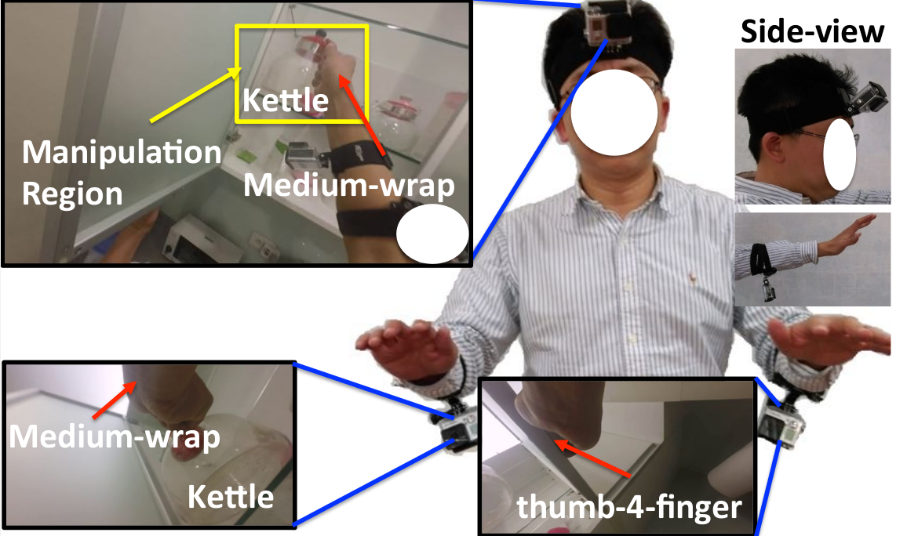
</center>

## Overview
> Recently, the technological advance of wearable devices has led to significant interests in recognizing human behaviors in daily life (i.e., uninstrumented environment). Among many devices, egocentric camera systems have drawn significant attention, since the camera is aligned with the field-of-view of wearer, it naturally captures what a person sees. These systems have shown great potential in recognizing daily activities(e.g., making meals, watching TV, etc.), estimating hand poses, generating howto videos, etc.
Despite many advantages of egocentric camera systems, there exists two main issues which are much less discussed. Firstly, hand localization is not solved especially for passive camera systems. Even for active camera systems like Kinect, hand localization is challenging when two hands are interacting or a hand is interacting with an object. Secondly, the limited field-of-view of an egocentric camera implies that hands will inevitably move outside the images sometimes.     
HandCam (Fig. 1), a novel wearable camera capturing activities of hands, for recognizing human behaviors. HandCam has two main advantages over egocentric systems : (1) it avoids the need to detect hands and manipulation regions; (2) it observes the activities of hands almost at all time.


## Implementation
1. Single Stream CNN
    In this work, the basic network that we're going to fine-tune is the [ResNet50](https://github.com/fchollet/keras/blob/master/keras/applications/resnet50.py). Due to the limitations of time and computation resources, we simply fine tune two version:
    * Last fully connect layer <br>
    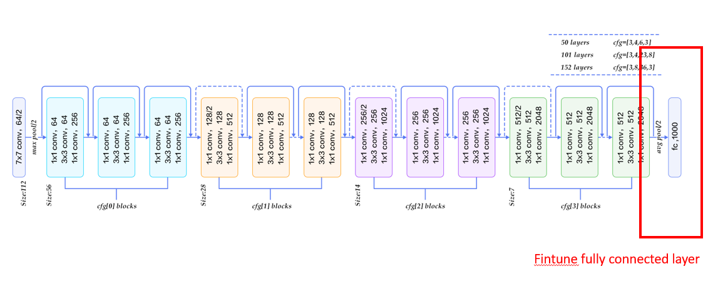
    * Last convolutional layer + fully connect layer
    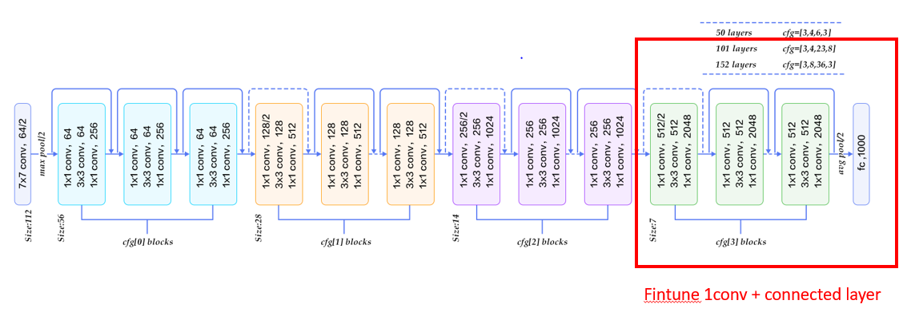 <br>
    <br>

2. Two-Stream CNN
    To achieve better performance, we implement the two stream CNN just like the architecture described in [paper](https://arxiv.org/abs/1512.01881) 
    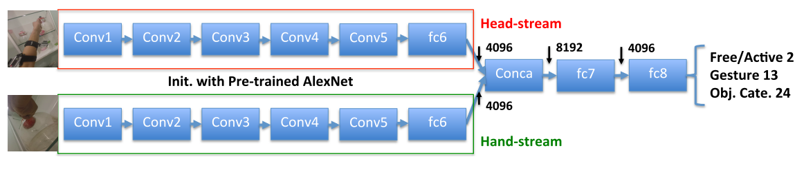 <br>
    <br>
    
3. Class Weight
    From the histogram below, we observe that there's a huge data unbalance (mostly sample belong to empty, i.e. no object)in the given dataset. Therefore, we try to make a compensation about it by having different weightings against different class.
    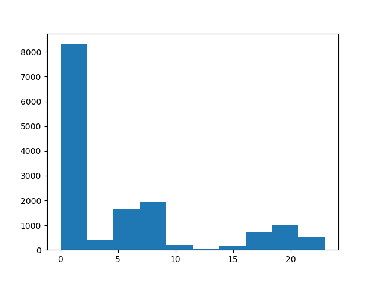 <br>

    ```
    def compute_class_weight(labelPath):
        with open(labelPath, 'r') as text_file:
            content = text_file.readlines()
        content = np.asarray(content)
        y = np.asarray([int(sample.split(' ')[2].strip('\n')) for sample in content] )

        classes = np.asarray(list(set(y)))
        le = LabelEncoder()
        y_ind = le.fit_transform(y)
        recip_freq = len(y) / (len(le.classes_) * bincount(y_ind).astype(np.float64))
        weight = recip_freq[le.transform(classes)]
        return weight
    ```
    <br>


## Installation
* python library for building deep neural network: [keras](https://keras.io/)
* python library for performing image augmentation: [imgaug](https://github.com/aleju/imgaug)


## Results

* Comparison: Weighted vs Noweighted when training
<table border=1>
<tr>
    <td> Weighted by class </td>
    <td> NoWeighted by class </td>
</tr>
<tr>
    <td> 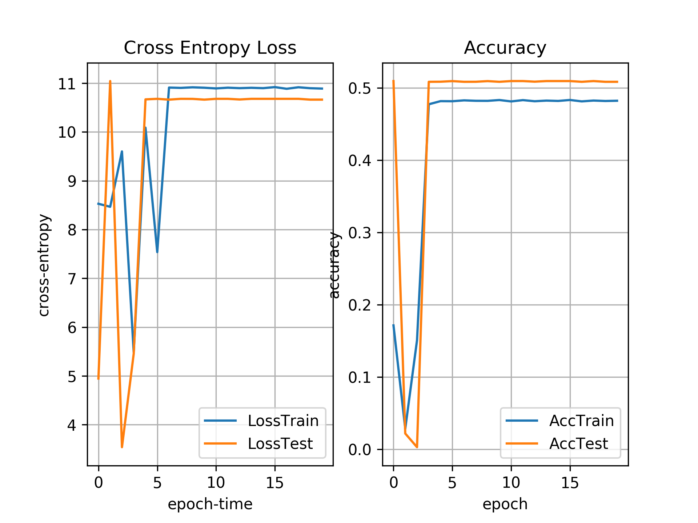 </td>
    <td> 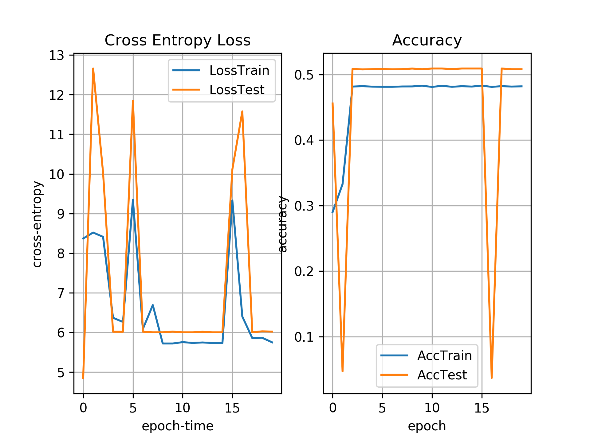 </td>
</tr>
</table>


* Comparison: Single stream vs Two stream
<table border=1>
<tr>
    <td> Single Stream </td>
    <td> Two Stream </td>
</tr>
<tr>
    <td> 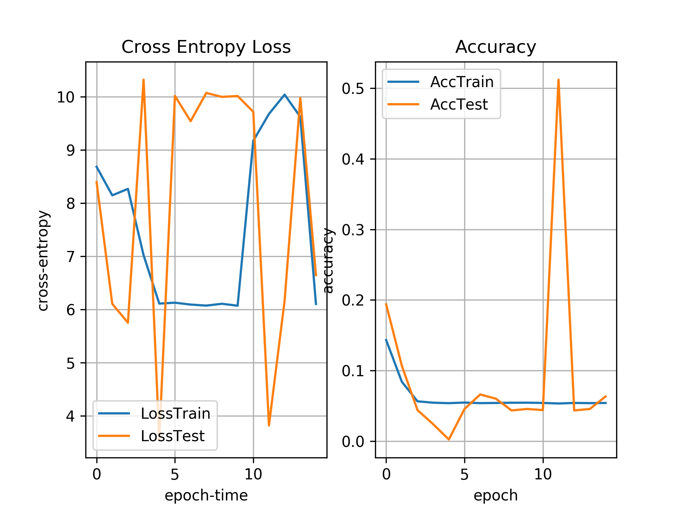 </td>
    <td> 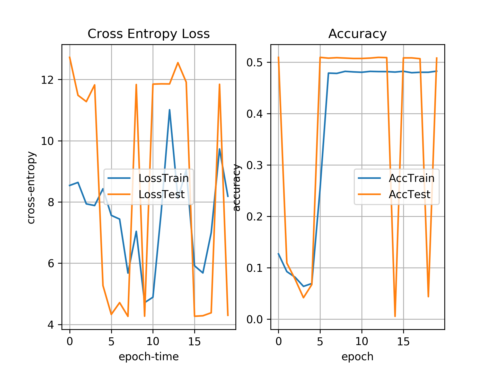 </td>
</tr>
</table>


* Comparison: Finetune fully connected layer only or Finetune conv+fc layer
<table border=1>
<tr>
    <td> FC only </td>
    <td> FC + 1-layer conv </td>
</tr>
<tr>
    <td>  </td>
    <td> 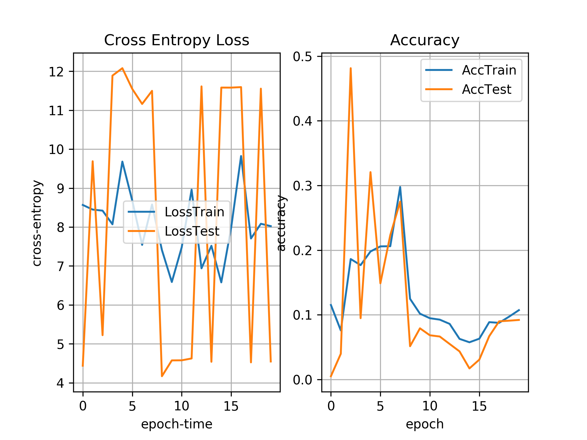 </td>
</tr>
</table>

* Comparison: flip input left to right or not
<table border=1>
<tr>
    <td> Fliplr </td>
    <td> No fliplr </td>
</tr>
<tr>
    <td> 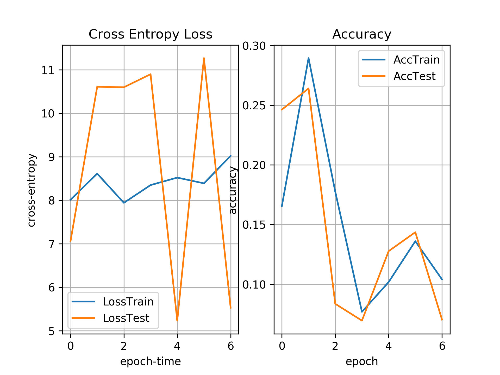 </td>
    <td> 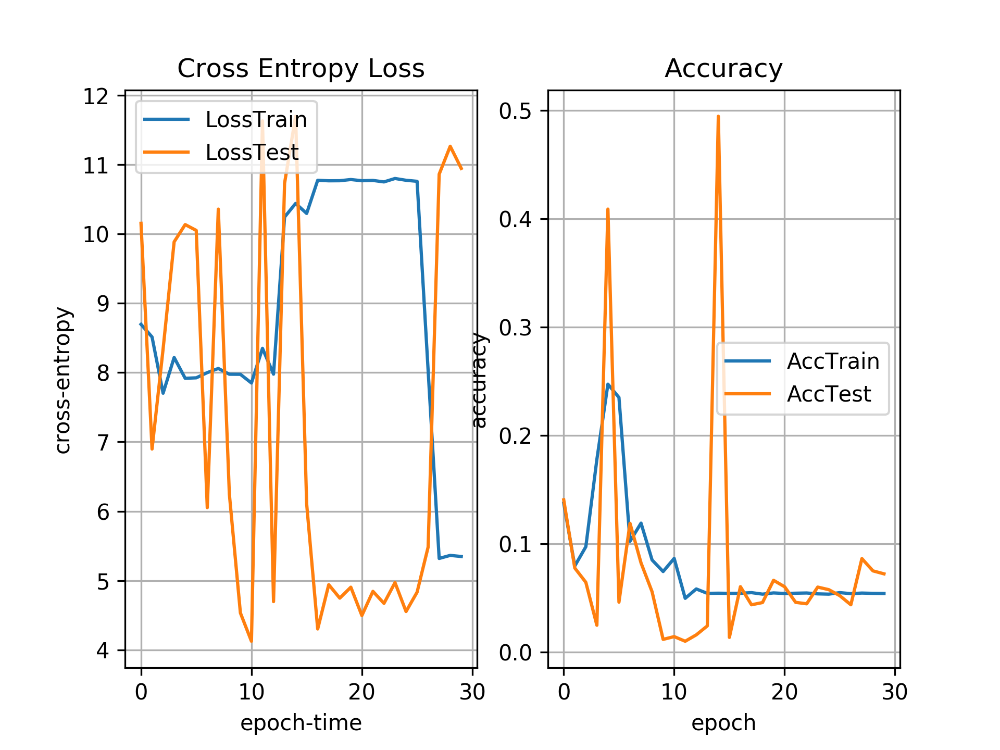 </td>
</tr>
</table>


## Discussion
After working exhaustedly, the best test accuracy I can achieve remains around <span style="color:red">0.51</span>. The weighting method doesn't seems to work, and either single stream or two stream network doesn't seem to construct a stable network. I guess the possible reason is that due to the GPU memory constrain, I didn't try larger batchsize while training by network, which results in quite label unbalance in each batch, and eventually the whole network crash. This is really an interesting task and I would really curious about how other classmates conquer this task. T_T

