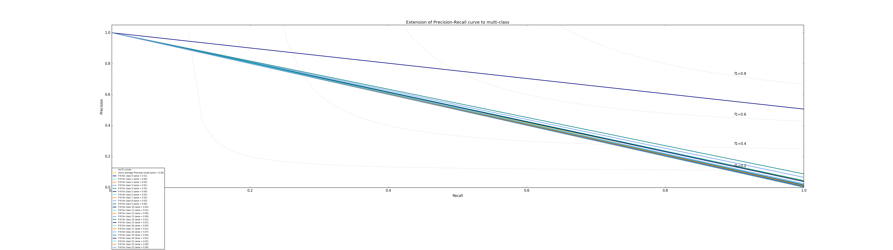

# 賴承薰 <span style="color:red">(105061583)</span>

## HW 1: Deep Classification

## Overview
The project is related to 
> handcam object classification

## Envs
* python 3.5
* tensorflow 1.2.1
* tensorflow.contrib.slim
* numpy
* PIL Image
* openCV
* os
* sklearn


## Implementation
1. Deep-learning based training model


* ResNet based network with 16 layers

```
net = slim.conv2d(inputs, 64 , [7, 7], stride = 2, scope = 'conv1')
net = slim.max_pool2d(net, kernel_size = [3, 3], stride = 2, padding = 'SAME', scope = 'max_pool1')
short_cut = net

net = slim.repeat(net, 2, slim.conv2d, 64, [3, 3], scope = 'conv2_1')
net = tf.add(net, short_cut)
short_cut = net

.
.
.
.
.
.
.

net = slim.repeat(net, 2, slim.conv2d, 256, [3, 3], scope = 'conv4_3')
net = tf.add(net, short_cut)
short_cut = net
net = slim.repeat(net, 2, slim.conv2d, 256, [3, 3], scope = 'conv4_4')
net = tf.add(net, short_cut)
		
net = slim.avg_pool2d(net, kernel_size = [3, 3], padding = 'SAME')
net = slim.flatten(net)
logits = slim.fully_connected(inputs = net, num_outputs = NUM_CLASS, scope = 'fc')
```

* Cross Entropy with logits

* Adam Optimizer

```
loss = tf.reduce_mean(tf.nn.softmax_cross_entropy_with_logits(logits = y_predict, labels= y_label))
optimizer = tf.train.AdamOptimizer(LR).minimize(loss)
```

## Results

### Accuracy
> 0.506603521878
### Loss
> 2.1569385
### Training time
> about 16.5 hrs
### Precision-Recall curve


