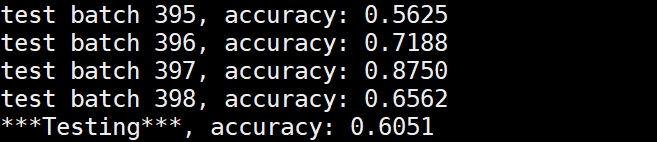

# 陳玉亭 <span style="color:red">(105061528)</span>

#Project 5: Deep Classification

## Overview
The project is related to
> A classification task on special view angle (hand cammera) system. The camera system consist of three wide-angle cameras, two mounted on the left and right wrists to capture hands (referred to as HandCam) and one mounted on the head (referred to as HeadCam). We want to classify 24 object categories, with a synchronized video has two sequence labelled, captured in three scenes: office, lab, and house.  


## Implementation
1. Single stream classificaion model (only use hand data)
	* I use model vgg19 as feature encoder and hand-captured images (left or right hand) as input. I just finetund from the pretrained 1000 classes ImageNet vgg19 model, that makes it converges faster than training from random weights.  
	* I set batch size = 32. I use Adam optimizer with learning rate 1e-4 and beta1 = 0.8. Train for 16000 iterations.   
2. Two-Straem classification model (use both hand and head data)  
	* I try another model structure which use 2-stream vgg19 model as feature encoders and use '+' operation on these two embeded features. Then pass the fushion feature to later classified layers.
	* The two-stream inputs are hand and head data. (left or right hand + head)  
	* I want to do 'concatenation' on the 2-stream embeded features at first, but I find that should re-initialize the 'fc8 layer' weight since its dimension is different from the pretrained model. The random initialized layer also influences the following layers. It needs more time to converge and I don't have enough time for training. So, I use '+' rather than 'concat' operation at last.        
```
Code highlights
```

## Installation
* Other required packages.
	* Tensorflow 1.1.0 
	* download vgg19.npy [https://mega.nz/#!xZ8glS6J!MAnE91ND_WyfZ_8mvkuSa2YcA7q-1ehfSm-Q1fxOvvs]
* How to run?
	* [Train] python test_vgg19_trainable.py (with setting 'training_mode' to True in line 22) 
	* [Test] python test_vgg19_trainable.py (with setting 'training_mode' to False in line 22) 
### Results

<table border=1>
<tr>
<td>
1. Single stream model with hand images as input</br></br>
Screenshot: </br>
<br>
testing accuracy : 60.51% </br></br>
Training loss and valid accuracy:</br>
</br>
</td>
</tr>

<tr>
<td>
2. Two-stream model with hand and head images as inputs</br></br>
Screenshot: </br>
<br>
testing accuracy : 49.86% </br></br>
Training loss and valid accuracy:</br>
</br>
The two-stream results wasn't better than single stream model. I guess possible reasons: (1) objects in head images often be occluded, did not provide useful information for the model. (2) observing form the training curve, the validation accuracy still increases around 40k iters. I think it could achieve higher testing accuracy if I trained it more steps.    
</td>
</tr>

</table>


