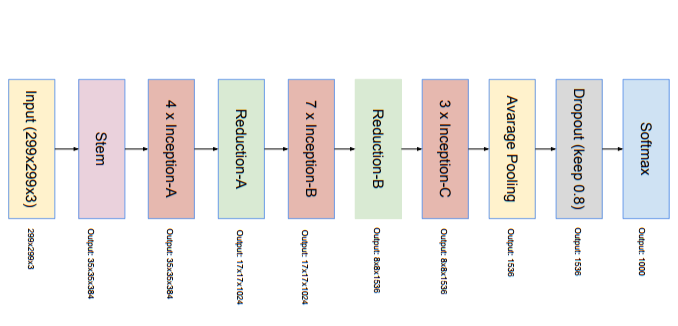

### Model Architecture
InceptionResNet v2

### Training Details
You can chech model implementation, training and evaluation detail(loss and accuracy) in ipython notebook.

[**Model InceptionResnetv2_baseline_Adam**](https://github.com/refu0523/homework1/blob/master/InceptionResnetv2_baseline_Adam.ipynb): 
- Model: InceptionResNet v2  
- Optimizer: Adam  
- Learning rate: 0.001  
- epoch: 20

**[Model InceptionResnetv2_baseline_SGD**](https://github.com/refu0523/homework1/blob/master/InceptionResnetv2_baseline_SGD.ipynb): 
- Model: InceptionResNet v2  
- Optimizer: SGD, momentum=0.9  
- Learning rate: 0.001 + reduce learning rate on plateau(patience=3)
- epochs: 20

[**Model InceptionResnetv2_two_step**](https://github.com/refu0523/homework1/blob/master/InceptionResnetv2_two_step.py):
- Model: InceptionResNet v2  
- step 1 : freeze all, except for fully connected layers 
    - Optimizer: rmsprop  
	- Learning rate: 0.001
	- epochs: 5
- step 2: freeze the layers befroe Reduction-A block
    - Optimizer: SGD, momentum=0.9
    - Learning rate: 0.0001 + reduce learning rate on plateau(patience=3)
    - epochs: 20

### Data augmentation
- rotation_range=5
- width_shift_range=0.1
- height_shift_range=0.1
- zoom_range=0.1
- horizontal_flip=True

### Result
Test Accuracy

| Model | Accuracy |  
|-------|----------|
| `InceptionResnetv2_baseline_Adam`| 0.678 |
| `InceptionResnetv2_baseline_SGD`| 0.727 |
| `InceptionResnetv2_two_step`| **0.736** |

