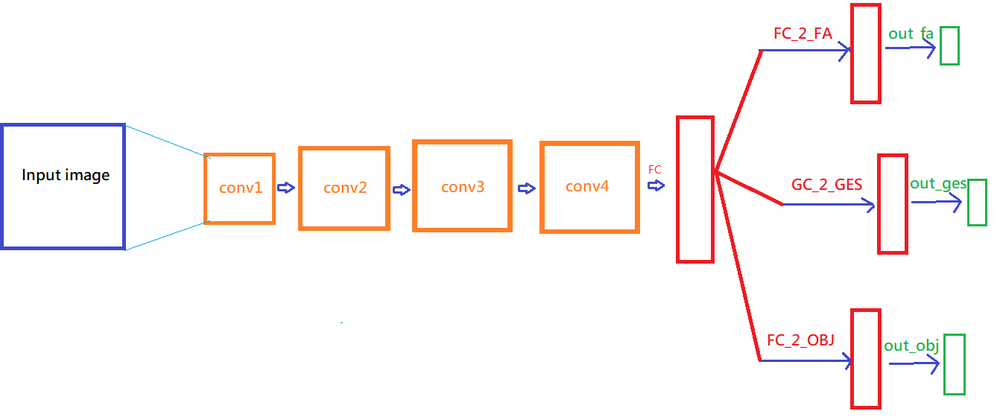

# 朱欣祈 106062510<span style="color:red">(orchinia)</span>

#Project 5: Deep Classification

## Overview
The project is related to 
> Deep convolutional neural network
> Object recognition
> Gesture state and recognition

## Implementation
1. Preprocessing
	* The resolution of input images is too large that is unnecessary, so I reduce the frame size from 1080*1920 to 135*240
	* Convert labels from integers to one-hot vectors
    * batch selection : select batch from training data randomly
2. Model architecture
    * Input hand images
    * Four layers of CNN(with pooling layers and batch norm layers)
    * and for each prediction goal (FA, gesture, object), apply 2 fully connected layers
    
    * use stochastic gradient descent for weight updating, softmax cross entropy for loss calculation
    * This model is more like a cnn encoder with multimodal classifier
3. hyperparameters
    * batch size = 20
    * number of iteration = 1000
    * learning rate = 0.0001
    * dropout rate = 0.2

4. Evaluation metrics
    * accuracy of fa = accuracy for prediction of hand free/active state
    * accuracy of ges = accuracy for prediction of hand gesture classification
    * accuracy of obj = accuracy for prediction of object detection
    * loss = loss_fa + loss_ges + loss_obj --> reduce loss

```
Code highlights
```


## Installation
* Require jupyter notebook platform
* open the notebook and run all
* frames folder and labels folder (datasets) should under folder same as CNN.ipynb
* testing accuracy can run 

### Results

<table border=1>
<tr>
<td>

</td>
</tr>


</table>


