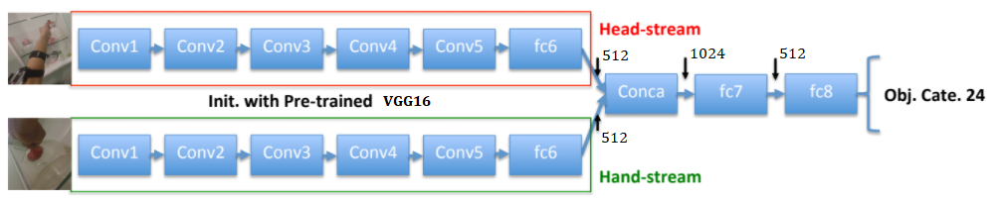
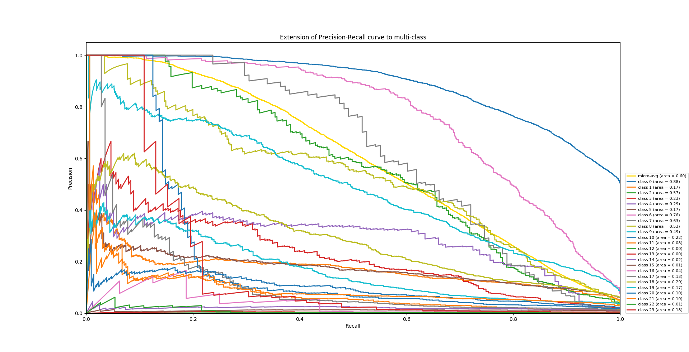
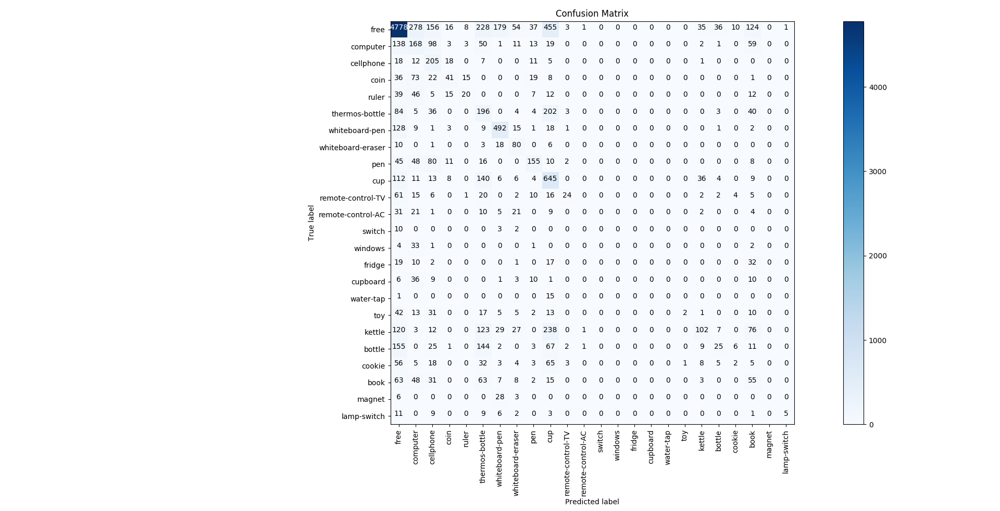
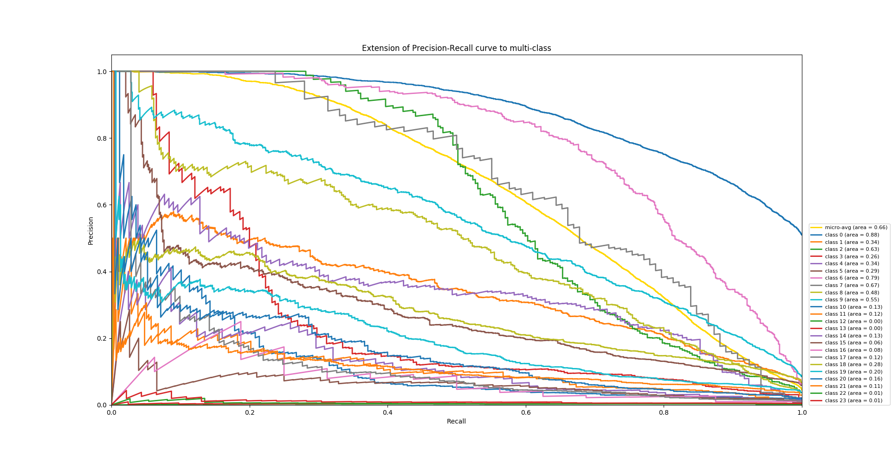
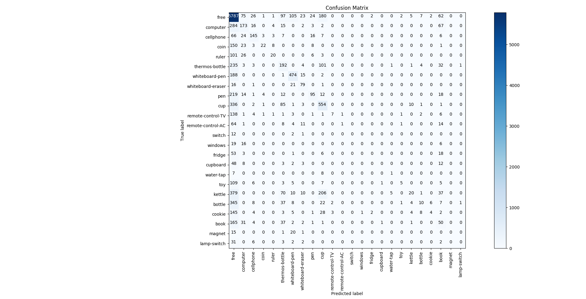

# 張偲宇 (106062555)

#Homework 1: Deep Classification

## Overview
The project is related to 
> Hand states (object categories) recognition from HandCam and HeadCam video frames.

## Implementation
1. load_datas
	* Load labels and images
	* Image preprocessing
		- `resize + random crop`
		- `horizontally flip left hand image to mimic right hand`

2. create_model
	* 
	* Using `tensorflow.contrib.keras.python.keras` to load and build models
	* Create `VGG16` model (pre-trained on ImageNet, only include convolutional blocks)
	* Add the following layers to VGG16 convolutional model `(single-stream)`
		- fc6 (512 neurons)
		- fc7 (512 neurons)
		- fc8 (24 neurons)
		- dropout (=0.5) between fc layers
	* Create `two-stream classifier` (fc7 + dropout + fc8)
	* DataGenerator: Generate mini-batch samples in training, validation and test set `(with shuffling training samples)`

3. train_model (training process)
	* Fine-tune `hand-stream` and `head-stream` CNN (Conv3, Conv4, Conv5)
	* Extract fc6 features (512 dimensions) in training and validation set from `hand-stream` and `head-stream` CNN
	* Concatenate `hand-stream` and `head-stream` fc6 features (1024 dimensions)
	* Train `two-stream classifier`
	* For all training process
		- Loss function: categorical cross entropy
		- Optimizer: SGD (learning rate=1e-4, momentum=0.9, decay=1e-6)

4. test_model (testing process)
	* Extract fc6 features (512 dimensions) in test set from `hand-stream` and `head-stream` CNN
	* Concatenate `hand-stream` and `head-stream` fc6 features (1024 dimensions)
	* Predict test set by two-stream classifier

5. evaluate_acc
	* Calculate accuracy
	* Plot precision recall curve
	* Plot confusion matrix

## Installation
* Other required packages.
	- numpy, opencv, scikit-learn, matplotlib
	- python 2.7 or >= 3.5

* How to compile from source?
	- python main.py
	
	- arguments: (default)
		+ --num-epoch=10
		+ --batch-size=16
		+ --val-split=0.2
		+ --num-fc-neurons=512
		+ --dropout=0.5
		+ --outdir='output'
		+ --run-deepq=False
	
	- dataset location:
		+ NTHUEE-DL2017-HW1 (DeepQ zip version)
		+ or '../../frames.zip', '../../labels.zip'

### Results

<table border=1>
<tr>
<td>
Only hand-stream CNN
</td>
</tr>
<tr>
<td>
testing acc. = 54.75%, 6995/12776
</td>
<td>
training time ~ 3.5 hrs
</td>
</tr>
<tr>
<td>

</td>
<td>

</td>
</tr>
<tr>
<td>
Two-streams CNN
</td>
</tr>
<tr>
<td>
testing acc. = 59.79%, 7639/12776
</td>
<td>
training time ~ 7.5 hrs
</td>
</tr>
<tr>
<td>

</td>
<td>

</td>
</tr>
</table>
