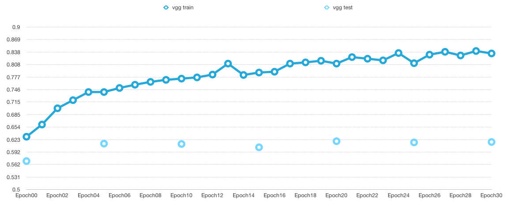
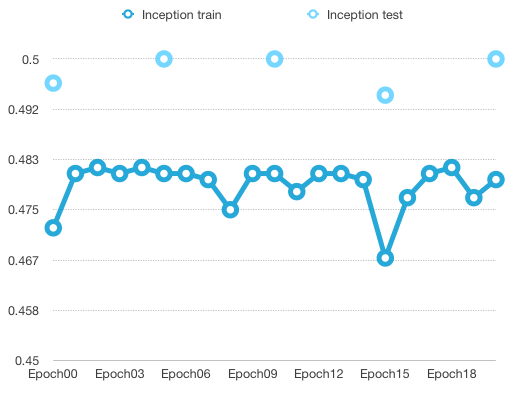
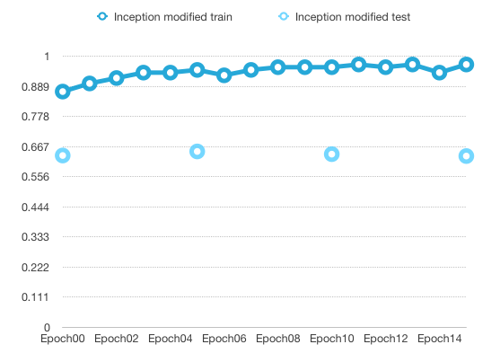
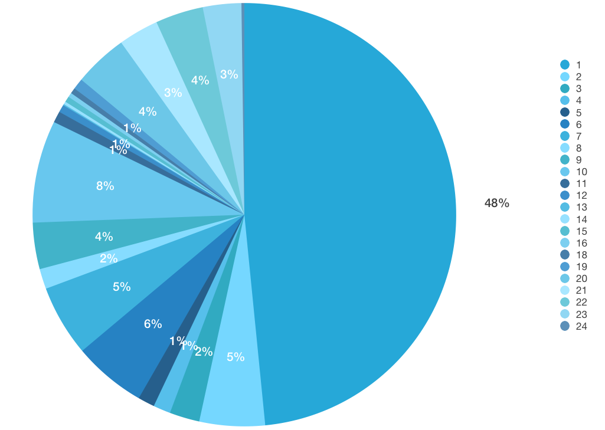
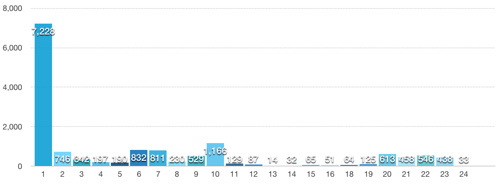

# YiChuanChang 張益銓 106062578

#Homework 01 Object Recognition

## Overview
The project is related to object recognition of the images from hand cameras. The original project is about detecting human daily behaviors including drinking water, typing on keyboard, taking some objects etc. In previous methods, people use only one camera to take whole scenario. So if we want to know the object the tester was taking, we need to crop out the area we are interesting in, the hand area. To prevent this process, the original preject introduced setting camera on each hand and one more camera on head to get more infomation. And based on these images and labels, we need to predict the hand guesture, human status and object. In my project, I simplify the problem to recognizing the object only.

### Reference
> <a href="https://drive.google.com/file/d/0BwCy2boZhfdBM0ZDTV9lZW1rZzg/view">Original project paper</a> 
> <a href="https://github.com/tensorflow/tensorflow/tree/master/tensorflow/contrib/slim/python/slim/nets">Inception resnet</a> 
> <a href="https://github.com/tensorflow/models/tree/master/research/slim#Pretrained">Pretrained model of Inception resnet source</a>

## Implementation
In this implementation, I used inception_resnet and the model which is pretrained with ImageNet. Baceuse we only have 24 classes instead of 1000 classes which is the original classes number of imageNet, I excluded the weight of the last layer when loading weight. Furthermore, because the original database is too large (51GB), I resize all the image with img_resize.py initially.

### Optimizer
I tried two optimizer. One is `tf.train.GradientDescentOptimizer()`. The other is `tf.train.AdamOptimizer()`. When using Gradient Descent, the training loss declines gradually, but it is too slow. So, I change the aptimizer to Adam, the loss declines more quickly, but soon the loss would not decline any more. 

### Image preprocessing
I tried two image processing. One is Image Preprocessing of VGG16. The other is image preprocessing of Inception Image Preprocessing. The reason why I uesd Preprocessing of VGG16 is that in the original resnet, the author use VGG16 to preprocess image. The result of this preprocessing is not bad. The heightest testing accuracy is 0.619.

But this model is not the original resnet model, I also tried Inception Image Preprocessing. However, the result is not good. The heightest testing accuracy is only 0.50. As a result, I tried to modified the preprocessing parameters, remove the color transfer and reduce the crop variance. Finally, I got a not bad result. The heightest testing accuracy is 0.649

## Installation
* python 3.6 (Anaconda)
* tensoflow (Anaconda)

## Results
x-axis is epoch number, y-axis is accuracy 
I test the model every 5 epoch

Use Image Preprocessing of VGG16 and inception resnet 
The best accuracy is 0.619

Use Inception Image Preprocessing and inception resnet 
The best accuracy is 0.5

Use modified Inception Image Preprocessing and inception resnet 
The best accuracy is <b>0.649</b>

### Future works
The training data is pretty bias. Just like shown below, alomost half of labels is 1 (which is 0 in original paper, means free.) In this situation, we may get onebatch with more than half of data is free. It would cause the model training going to be close to somewhere. So, my thought is that maybe we can remove some of "free" images to acheive the balance of classes.

