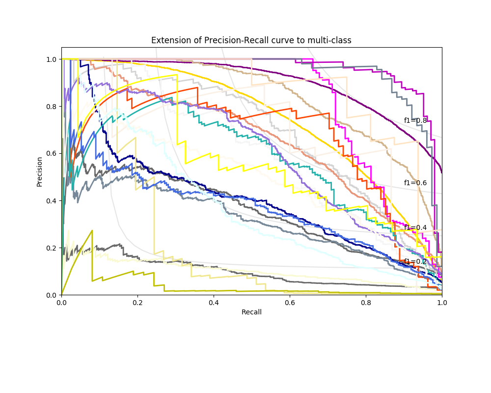
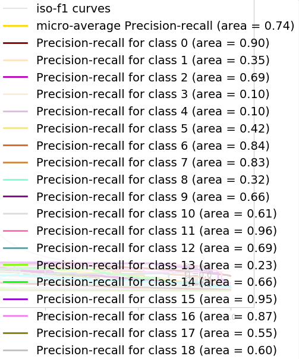
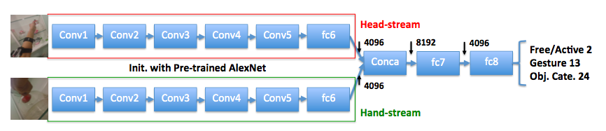
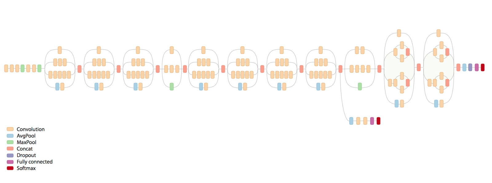

# 洪彗庭 106061532 CEDL-hw1 <span style="color:red"></span>

## Overview
In this homework we implement 2 models on doing object-classification, the highest accuracy we reach is **0.6667** in InceptionV3 model. We will go through details on preprocessing data, model structure and some tricks on training in the following. Since I am still not pretty familiar with tensorfow, I choose to use keras on the second model implementation to speed up the develop process.

* 2-streams [Alexnet](https://papers.nips.cc/paper/4824-imagenet-classification-with-deep-convolutional-neural-networks.pdf) implementation in tensorflow: [finetune_AlexNet.py](../finetune_AlexNet.py) 
* 1-stream [InceptionV3](https://arxiv.org/pdf/1512.00567.pdf) implementation in keras: [finetune_InceptionV3.py](../finetune_InceptionV3.py) 

I mainly modified the code from [here](https://kratzert.github.io/2017/02/24/finetuning-alexnet-with-tensorflow.html) for Alexnet and [here](https://keras.io/applications/) for InceptionV3.

#####Other files: </br>
* [simplenn.py](../simplenn.py): for building 2 simple fc layers. </br>
* [PreprocessData.py](../PreprocessData.py): preprosess data and label directory as we need. </br>
* [datagenerator_non2string.py](../datagenerator_non2string.py), [datagenerator.py](../datagenerator.py): preprocess of data
* [alexnet.py](../alexnet.py): model of AlexNet

## Results
| Model | Accuracy(10th epoch) |  Accuracy(40th epoch) |
|-------|----------|----------|
| Alexnet- 2-streams (hand + head, object label)| 0.5658 | 0.6136 |
| InceptionV3- 1-stream (hand, object label)| 0.6549 | **0.6667** |

###Precision Recall Curve
<div>


</div>

## Setup
### Env
* OS : Windows 10
* python 3.5.3
* tensorflow 1.2.1
* keras 2.0.6
* 1 Nvidia GeForce GTX 970 4G GPU
* Intel(R) Core(TM) i7-6700 CPU
* CUDA 8.0.6
* cuDNN 5

### Other Packages
* sklearn
* cv2
* numpy
* pandas

## Implementation
### Data directory structure
please put the data directly as follows:

```
resize_data/
	frames/
		labels/
		test/
			house/
				4/
				5/
				6/
			lab/
				5/
				6/
				7/
				8/
			office/
				4/
				5/
				6/
		train/
			house/
				1/
				2/
				3/
			lab/
				1/
				2/
				3/
				4/
			office/
				1/
				2/
				3/
```
### Model Structure
1. **AlexNet**: </br>
According to the [paper](https://drive.google.com/file/d/0BwCy2boZhfdBM0ZDTV9lZW1rZzg/view) provided in this assignment, the 2-streams structure is as follows:

Therefore, simply concate the two streams output(hand, head) from fc6 and on top of it add 2 simple fully-connected layers.</br>
In the Discussion part we will discuss more on the result of 1-stream versus 2-streams.</br>

2. **InceptionV3**: </br>
The InceptionV3 model was proposed in 2015 and achieve 3.5% top-5 error rate ImageNet dataset. It imporves several parts compared with InceptionV2, such as the idea of factorization of convolutions. Compare between Alexnet and Inception model, the Inception model use less number of parameters but improves the efficiency in using parameters. The structure looks as follows: </br>

I didn't do any modification on the InceptionV3 model, but just add 2 fully-connected layers on top of the InceptionV3 model.

### Training Detail
1. **AlexNet**:</br>
I didn't fintune all layers, since sometimes it will lose the advantage of loading pretrain parameters into the netwrok. I **freeze the first 2 bottom layers** (i.e. conv1, conv2) and finetune from conv3 to fc6 and also finetune on the additional 2 layers I add above the concate result.
2. **InceptionV3**:</br>
**First**: finetune the 2 layers I add above the whole structure (i.e. **freeze all layers in the InceptionV3**) </br>
**Second**: finetune the 2 layers I add on top and 2-stages of InceptionV3(i.e. **freeze the bottom 249 layers**)</br>
In this way, we can first avoid that since the layers we initialize is too bad (think of it as random generates), it prones to ruin the parameters if we directly finetune them with loaded weight InceptionV3 model. Also, on the second time of finetuning, it can converge more easily since we have already trained the first top 2 layers which are initially pretty worse.


## Discussion
1. Preprocess of data (shuffle do important ! )</br>
Initially I divide the train/val data in a wrong way, which I didn't apply shuffle on data before divide into train-set and validation-set. The result between non-shuffle and shuffle data is as follows: </br>

| Best-val-loss / Best-val-Acc | non-shuffle | shuffle |
|-------|----------|----------|
| Model-InceptionV3| 1.7323 / 0.6119 | 0.1381 / 0.9579 |

Especially the data we get this time is the sequence frames of the vedio, so the drawback of un-shuffle data will be more obvious in this task.

2. One stream v.s. Two streams 

| Accuracy | 1-stream | 2-streams |
|-------|----------|----------|
| Model-AlexNet| 0.4175 | 0.5658 |

One thing need to notice is that I can't confirm that the 2-streams result will definitely beat the result of 1-stream, since the setting of 1-stream and 2-streams are as follows: </br>

| | learning-rate | finetune-layers | epoch | batch-size |
|-------|----------|----------|--------|------|
| 1-stream|  0.001 | fc7, fc8 | 10 | 128 |
| 2-streams|  0.001 | conv3, conv4, conv5, fc6, fc7, fc8 | 10 | 16 |

The setting on the two is a little bit different (finetune-layers and batch-size), so I am not 100 percent for sure that 2-streams is better than 2-stream.

## Acknowledgement
Thanks the awesome tutorial of finetuning on AlexNet done by [Frederik Kratzert](https://kratzert.github.io/2017/02/24/finetuning-alexnet-with-tensorflow.html). </br>
Also thanks [Zayn Liu](https://github.com/refu0523) giving me so many advice on finishing this assignment.

## Reference
[scikit-learn lib on drawing precision-recall-curve](http://scikit-learn.org/stable/auto_examples/model_selection/plot_precision_recall.html)

[code of little data for fintuning](https://gist.github.com/fchollet/7eb39b44eb9e16e59632d25fb3119975)

[keras example](https://keras.io/applications/#resnet50)

[alexnet](https://papers.nips.cc/paper/4824-imagenet-classification-with-deep-convolutional-neural-networks.pdf)

[Inceptionv3](https://www.pyimagesearch.com/2017/03/20/imagenet-vggnet-resnet-inception-xception-keras/)
