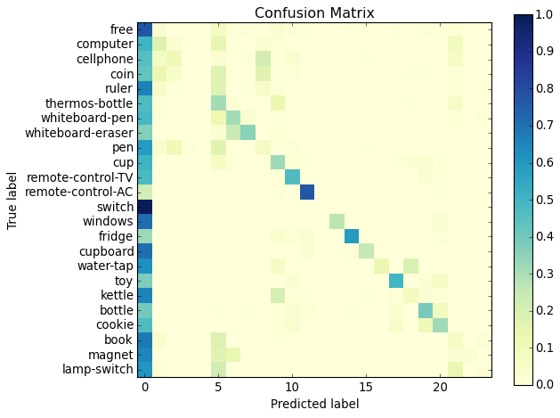
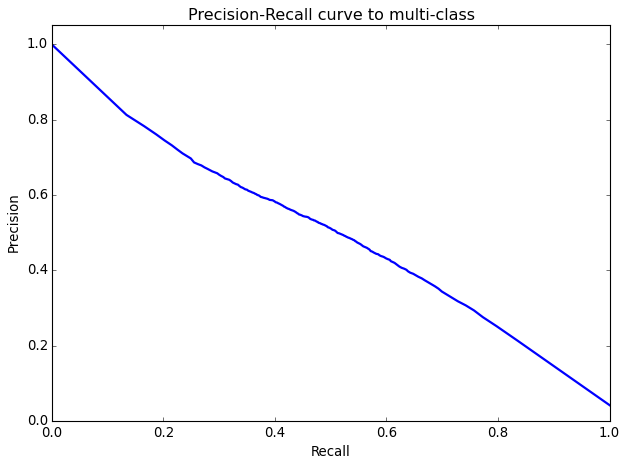

# Jhen-Yu Jhang <span style="color:red">(id: 105061516)</span>

#Project 5: Deep Classification

## Overview
The project is related to 
> Make a classifier for dataset: handcam.
> Modify from mobilenet.
> Training settings is in script.
> Use three loss source in handcam only.


## Implementation
1. Python
2. Tensorflow
	* Slim
	
What I did is to fit the Handcam with motify the codes in "code/datasets" and "code/nets".


3. datasets:
To convert the images and labels to the data-input structure, I created the files, "convert_handcam.py", "handcam.py", "handcamfa.py", "handcamobj.py", "handcamges.py"

3-1. convert_handcam
The propose of the file is to transfer the data structure of dataset "handcam" into the npy files.

3-2. handcam*
The propose of the file is to load the input images and ground-truth labels from the npy files.
handcam loads three labels of every images and the images.
handcamfa loads the free/active labels and the images.
handcamobj loads the object labels and the images.
handcamges loads the gesture labels and the images.

4. nets
I modified the mobilenet as the file "mobilenet2". The output of the model increase to three labels, to fit the homework task.

```
end_points['Logits'] = logits
end_points['Predictions'] = predictions
end_points['Logits1'] = logits1
end_points['Predictions1'] = predictions1
end_points['Logits2'] = logits2
end_points['Predictions2'] = predictions2
```

## Installation
* matplotlib
* Sklearn

### Results

These are the results for object classification task.
<table border=1>
Confusion matrix


<table border=1>
</table>
<tr>
precision recall curve

</tr>

</table>


