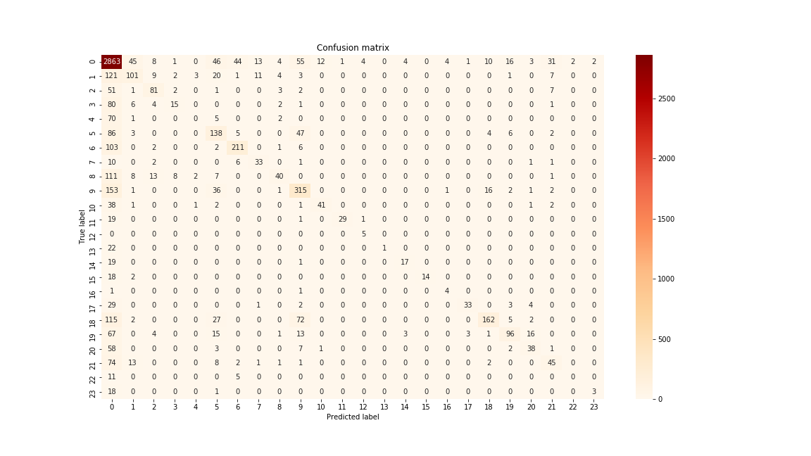

# Your Name <span style="color:red">(id)</span>
103062334 楊炫恭

## Overview
The project is related to 
> Image classification based on the dataset that recorded by hand camera system. We want to classify the type of objects in our hands.

## Implementation
### Model Architectures
Implement on **ResNet 50** with batch normalization


which described in the paper ["Deep Residual Learning for Image Recognition"](https://arxiv.org/abs/1512.03385) and used in [ImageNet Dataset] (http://image-net.org/challenges/LSVRC/2015/).

### Pre-trained model
To imitate the structure of the model, we have used `.caffemodel` files provided by the [authors](https://github.com/KaimingHe/deep-residual-networks). And the conversion has been performed using [Caffe to TensorFlow](https://github.com/ethereon/caffe-tensorflow)

### Dataset
Only use image provided from `hand camera`

## Training detail
### Fine-tune
We fine-tune last fully-connected layer, and trained for about **20 epoch** using `Poly learning rate` polciy:
```
lr = base_lr * (1 - iter/max_iter) ^ (power)
```

### Hyper parameter
*  EPOCH = **20**
*  BASE_lr = **0.001**
*  POEWR = **0.9**
*  Batch_size = **64**
*  Optimizer: Using **Adam optimizer**

### Data Augementation & Pre-processing
1. Resize to **500 x 500**
2. Random left-right flip
3. Subtract Image mean 

## Setup 
1. Get checkpoint from [Google Drive](https://drive.google.com/drive/folders/0B9CKOTmy0DyaQlA3OWRiTkt2Q0k?usp=sharing)
and put into `./snapshots`
2. Download the dataset from [Google Drive](https://drive.google.com/drive/folders/0BwCy2boZhfdBdXdFWnEtNWJYRzQ) and copy them into `./dataset`
3. Run `evaluate.py`

### Results

<table border=1>
<tr>
<td>

</td>
</tr>

<tr>
<td>


</td>
</tr>

</table>


