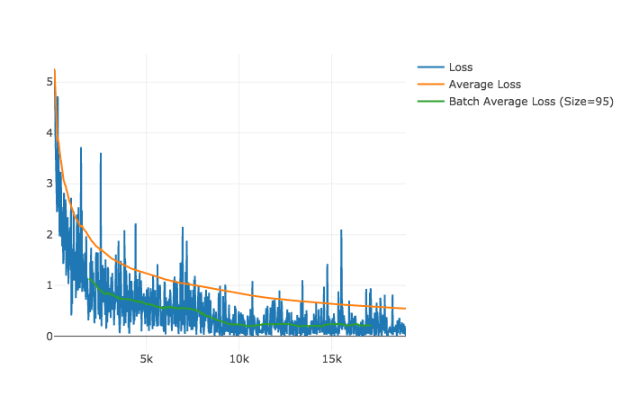

# 許家銘 <span style="color:red">106061806</span>

# Homework 1: Deep Classification

## Overview

The project is related to classify 24 object categories by applying deep neural network.

## Implementation

The best performance model is applied as follows:

* Dual-stream pretrained VGG16 CNN 

    ```
        Hand Image -> VGG16 ->                  -> FA
                              -> Concat -> FC ->-> GES
        Head Image -> VGG16 ->                  -> OBJ
    ```
    
* Batch Normalization
* Scale smaller side of image to 256
* Random crop image to 224x224
* Random horizontal flip
* L2 regularization
* Decay learning rate by 0.1 every 8000
* Weighted loss

Code Snippets

```python
class Model(nn.Module):

    def __init__(self):
        super().__init__()
        pretrained_net = models.vgg16_bn(pretrained=True)

        self._feature = pretrained_net.features

        fc1 = [it for i, it in enumerate(pretrained_net.classifier.children()) if i < 3]
        self._fc1 = nn.Sequential(*fc1)

        self._fc2 = nn.Sequential(
            nn.Linear(8192, 4096),
            nn.ReLU(True),
            nn.Dropout(),
        )

        self._fa_logits = nn.Linear(4096, 2)
        self._ges_logits = nn.Linear(4096, 13)
        self._obj_logits = nn.Linear(4096, 24)

    def forward(self, hand_images, head_images):
        hand_features = self._feature(hand_images)
        head_features = self._feature(head_images)

        hand_features = hand_features.view(-1, 512 * 7 * 7)
        head_features = head_features.view(-1, 512 * 7 * 7)

        hand_fc1 = self._fc1(hand_features)
        head_fc1 = self._fc1(head_features)

        features = torch.cat([hand_fc1, head_fc1], dim=1)

        features = self._fc2(features)

        fa_logits = self._fa_logits(features)
        ges_logits = self._ges_logits(features)
        obj_logits = self._obj_logits(features)

        return fa_logits, ges_logits, obj_logits

    @staticmethod
    def loss(fa_logits, ges_logits, obj_logits, fa_labels, ges_labels, obj_labels, obj_weight):
        fa_cross_entropy = torch.nn.functional.cross_entropy(input=fa_logits, target=fa_labels)
        ges_cross_entropy = torch.nn.functional.cross_entropy(input=ges_logits, target=ges_labels)
        obj_cross_entropy = torch.nn.functional.cross_entropy(input=obj_logits, target=obj_labels, weight=obj_weight)
        return fa_cross_entropy, ges_cross_entropy, obj_cross_entropy
```

## Installation

### Requirements

* Python 3.6
* PyTorch >= v0.2.0
* visdom
* tqdm
* matplotlib

## Setup
* Prepare your data and make folder structure as follows:

    ```
    Project Root
        - data
            - frames
                - test
                    ...
                - train
                    ...
            - labels
                ...
    ```
    
## Usage

1. Train

    ```
    $ python train.py -d=./data -l=./logs
    ```
    
    or restore from a checkpoint

    ```
    $ python train.py -d=./data -l=./logs -r=./logs/model-100.pth
    ```

1. Evaluate

    ```
    $ python eval.py ./logs/model-100.pth -d=./data -m=test
    ```

1. Visualize

    ```
    $ python -m visdom.server
    $ python visualize_loss.py --logs_dir=./logs
    ```

1. Clean

    ```
    $ rm -rf ./logs
    ```


### Results

* **Best result: accuracy = `74.44%`**

* Loss

    

* Details

    * All 0 are predicted: accuracy = `50.09%`
    
    * Single-stream with single-task
    
        1. Version 1: accuracy = `62.95%`
            * Alexnet
            * 10000 steps
            * Scale(300)
            * RandomHorizontalFlip()
            * batch_size = 64
            * initial_learning_rate = 1e-3
            * decay_steps = 8000
            * decay_rate = 0.1
            
        2. Version 2: accuracy = `63.12%`
            * Alexnet
            * 10000 steps
            * Scale(300)
            * RandomHorizontalFlip()
            * batch_size = 64
            * initial_learning_rate = 1e-3
            * decay_steps = 8000
            * decay_rate = 0.1
    
    * Dual-stream with single-task
    
        1. Version 1: accuracy = `63.92%`
            * Alexnet (pretrain features)
            * 10000 steps
            * Scale(300)
            * RandomHorizontalFlip()
            * batch_size = 128
            * initial_learning_rate = 1e-3
            * decay_steps = 2500
            * decay_rate = 0.1
            
        2. Version 2: accuracy = `63.88%`
            * Alexnet (pretrain features + fc6)
            * 10000 steps
            * Scale(256)
            * RandomCrop(224)
            * RandomHorizontalFlip()
            * batch_size = 128
            * initial_learning_rate = 1e-3
            * decay_steps = 8000
            * decay_rate = 0.1
    
    * Dual-stream with multi-task
    
        1. Version 1: accuracy = `65.65%`
            * Alexnet (pretrain features + fc6)
            * 10000 steps
            * Scale(256)
            * RandomCrop(224)
            * RandomHorizontalFlip()
            * batch_size = 128
            * initial_learning_rate = 1e-3
            * decay_steps = 8000
            * decay_rate = 0.1
            
        2. Version 2: accuracy = `73.65%` 
            * Vgg16 + Batch Normalization
            * 30000 steps
            * Scale(256)
            * RandomCrop(224)
            * RandomHorizontalFlip()
            * batch_size = 16
            * initial_learning_rate = 1e-3
            * decay_steps = 8000
            * decay_rate = 0.1        
            
        3. Version 3: accuracy = `74.44%` 
            * Vgg16 + Batch Normalization
            * 18000 steps
            * Scale(256)
            * RandomCrop(224)
            * RandomHorizontalFlip()
            * batch_size = 16
            * initial_learning_rate = 1e-3
            * decay_steps = 8000
            * decay_rate = 0.1
            * weighted loss
