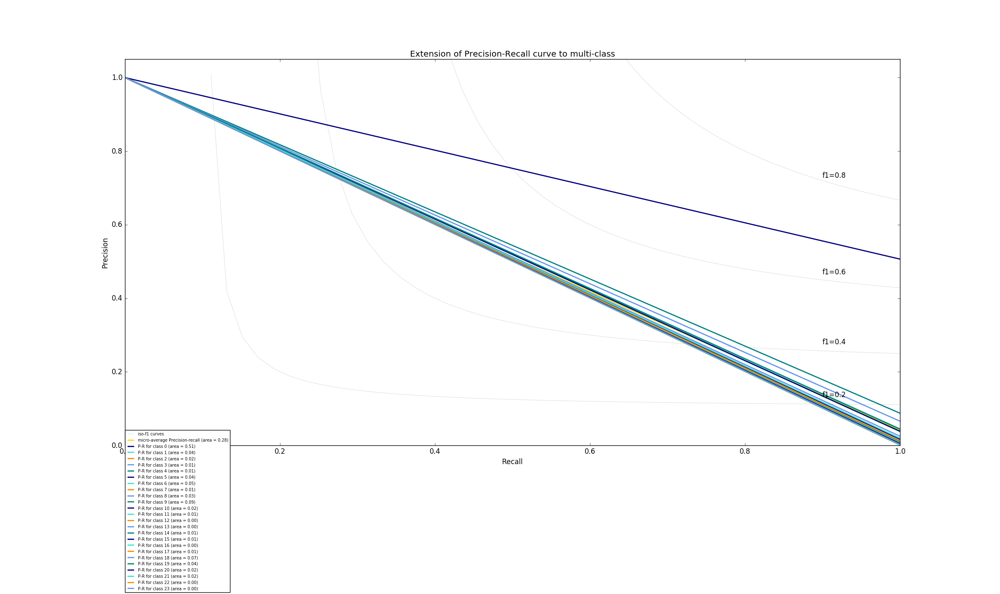

# 賴承薰 <span style="color:red">(105061583)</span>

## HW 1: Deep Classification

## Overview
The project is related to 
> handcam object classification

## Envs
* python 2.7
* tensorflow 1.2.1
> training and learning APIs
* tensorflow.contrib.slim
> build the structure of the model
* numpy
> computation and calculation
* PIL Image
> handle images
* openCV
> handle images
* os
> import dataset
* sklearn
> draw curve
* Nvidia GeForce GTX 1080-Ti GPU (Thanks to HTC DeepQ team!)


## Implementation
1. Single-stream ConvNet
* Utilizing only HandCam (Object Detection only)

2. Deep-learning based training model

* ResNet based network with 24 layers
[1] Deep Residual Learning for Image Recognition
https://arxiv.org/pdf/1512.03385.pdf

input width = 96, keeping the image aspect unchanged
A ResNet-like network with fewer layers to speed up training process

```
net = slim.conv2d(inputs, 64 , [7, 7], stride = 2, scope = 'conv1')
net = slim.max_pool2d(net, kernel_size = [3, 3], stride = 2, padding = 'SAME', scope = 'max_pool1')
short_cut = net
.
.
.
.
.
net = slim.avg_pool2d(net, kernel_size = [3, 3], padding = 'SAME')
net = slim.flatten(net)
logits = slim.fully_connected(inputs = net, num_outputs = NUM_CLASS, scope = 'fc')

```


* Loss function:Cross Entropy with logits
* AdamOptimizer adapted
```
loss_func = tf.reduce_mean(tf.nn.softmax_cross_entropy_with_logits(logits = y_logits, labels= y_label))
optimizer = tf.train.AdamOptimizer(LR).minimize(loss_func)
```


## Installation
* Download [image list](https://drive.google.com/file/d/0B-MtVXQMUxQiVzZiZmZOZy0talE/view?usp=sharing) for data input.
* `hw1_train.py` to train the model.(GPU recommended)

* Usage is as follows:
1. `--o`: Set output direction, default = `./` (current dir)
2. `--epoch`: Set number of iterations, otherwise defalut `30`.
3. `--LR`: Set the learning rate, otherwise defalut `10**(-3)`.


## Results

### Accuracy
> 0.506603521878
### Loss
> 2.1569385
### Training time
> about 16.5 hrs
### Precision-Recall curve


