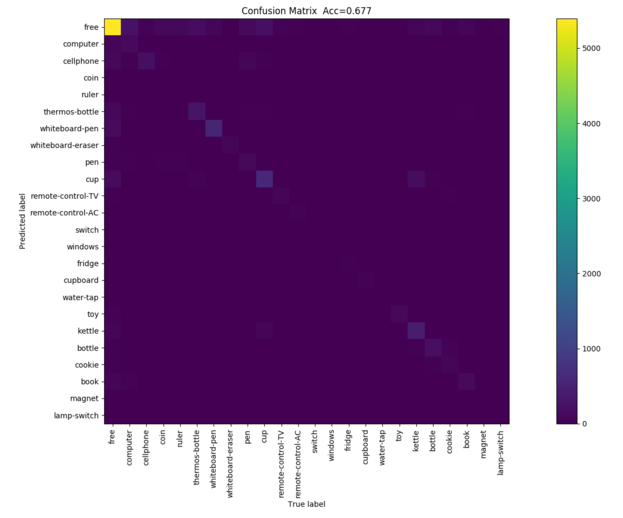

# 趙浚宏 (106061611)

# Project 5: Deep Classification

## Overview
The project is related to [Recognition from Hand Cameras:
A Revisit with Deep Learning](https://drive.google.com/file/d/0BwCy2boZhfdBM0ZDTV9lZW1rZzg/view). 
> We revisit the study of a wrist-mounted camera system (re-
ferred to as HandCam) for recognizing activities of hands. HandCam has two unique properties as compared to egocentric systems [1, 2] (referred
to as HeadCam): (1) it avoids the need to detect hands; (2) it more
consistently observes the activities of hands. By taking advantage of
these properties, we propose a deep-learning-based method to recognize
hand states (free vs. active hands, hand gestures, object categories), and
discover object categories.


## Implementation

* **Network Architecture**


   


* **Multitask Loss**

	```
		Loss = \lambda_1 * CrossEntropy(FA_OUTPUT, FA_LABEL) + \lambda_2 * CrossEntropt(OBJ_OUTPUT, OBJ_LABEL)
	```

* **Trained 30 epochs** 

* **Adam Optimizer lr=1e-3**

## Installation

* numpy 1.13.3
* pytorch 0.2.0

## Results

* House Scene

  

* Lab Scene

  

* Office Scene

  


* All

  

