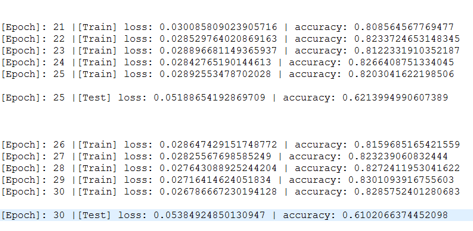

# 潘珠峰 <span style="color:red">(103000096)</span>

#Project 5: Deep Cl    sification

## Overview
The project is related to hand gesture classification. The project is based on [this repo](https://github.com/kratzert/finetune_alexnet_with_tensorflow)


## Implementation
1. Transfer learning from AlexNet
	* Loading the pretrained [AlexNet](http://papers.nips.cc/paper/4824-imagenet-clsification-with-deep-convolutional-neural-networks.pdf)
	* Finetune the AlexNet on the last three fully connected layers
	* The reason for choosing AlexNet is it's not too large and given the limited data size, suitable for this task.
2. Data augmentation
	* Compressing the data into 227 * 227 pixel
	* Flipping all images in training set horizontally, named      aug_Imagexxx.png with same label      the original image instance.
	* Doubling the size of training set


```
Codes are stored in all the files in the root folder.
```

## Installation
* Required packages: numpy,scipy,scipy,tensorflow,os,re,PIL
* the data folder should be in the same path with all the codes
* get the weights on AlexNet from [this link](http://www.cs.toronto.edu/~guerzhoy/tf_alexnet/)

## Usage
* wget http://www.cs.toronto.edu/~guerzhoy/tf_alexnet/bvlc_alexnet.npy
* python data.py 
* python mktxt.py
* python finetune.py


### Results
The average test accuracy is about 67.8% on the test dataset after 80 epoch.

<center>

</center>

