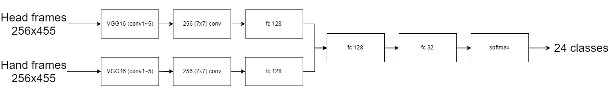
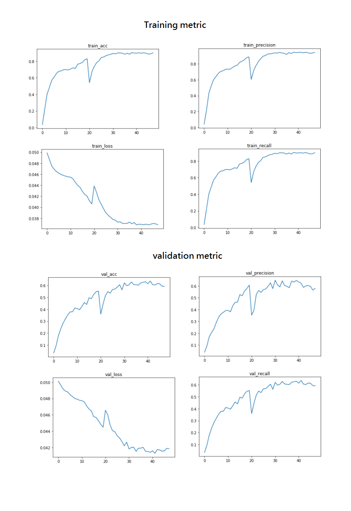

# 林杰 (Hubert) (102000039)

#Project 1: Deep Classification

## Overview

最開始我認為這是一個建模問題，但稍微做了一些簡單的視覺化、試跑，馬上就會發現這是個問題很多的 dataset ，就個人過往經驗來看，滿分五分的話這個 dataset 大概只有 2 分，以下針對這個 dataset 有哪些問題與我怎麼應對做說明。

#### 無用資訊過多

這部分專指檔案本身，過高的解析度並沒有太多意義， 1080x1960 的影像為了可以有較大的 batch size ，最終終究要壓縮，這邊我與同學是壓縮成 256x455 ，雖然表面上是 42GB 的超大型 dataset ，但實際使用上只會使用到 1/16 甚至更少，我個人認為縮成 1/16 可能仍太過保守。

#### 重複資訊過多、資料多樣性過低

表面上資料有 10k frame 左右，但因為是 video ，前後 frame 之間相似性非常高，再加上有些物體根本只出現 1~2 次，被連續的 frame 灌水成 50~100 個 samples ，如果不是 class imbalance 問題也很嚴重，這個應該會是首要問題。

我沒有人工檢查 train/test 中的物體是否是相同物體，但我相信最終的 model 在這些 class 上是 overfit 非常嚴重、無法 generalize 到現實生活中。

在這邊的解決方法非常簡單且消極，就是不用管他，因為下一個提到的 class imbalance 問題讓這些 class 就算 totally fail ，依舊能有不錯的 accuracy / global precision / global recall 。

也許會提到 data augmentation ，但:
1. Data augmentation 不是萬能的，他不可能只從物體的一個面向 augment 出根本不存在的資訊。
2. Tensorflow 目前 data augmentation 的支持並不多（沒有支持接受 tensor 的 rotate function ），所以我只做左右翻轉而已，自己改寫的話 effort 高過 expected gain ，所以我做到一半就決定跳過。

#### Class imbalance

這是非常典型的問題，但在這個 data set 上特別嚴重，光 free / empty (i.e. class 0) 就佔 48% ，直接硬 train 的話，雖然 accuracy 可以達到 0.65 ，但 average precision/recall 只有 0.24 左右，可以說是非常糟糕。

此外，也因為這個問題，衍生了另一個問題，就是 validation 結果與 test mismatch ， validation accuracy 只有 0.45 ，但 test 卻穩定的有 0.65 ，我認為這是 test 的 class 0 sample 又比 train / val 更高所造成。

一般處理這狀況的方法有：

1. upsample / downsample / class weight tuning : 這邊不太可行，因為這個充滿問題的分布在 train / val / test 中都均勻存在，再加上有些 class 出現次數過少，在那些 class 上只會 overfit ，就算實務上 val / test measure 都有提升，倫理上也不該做這種事。

2. 直接把出現次數過少的 class 移除：但這有違反 spec 的嫌疑。

我這邊採用自己的想法，先 train on 移除掉 class 0 的 data ，確保在 learn feature 的時候不會因為 class 0 的 gain 過高，一開始就卡在 local minimum ，造成 model 沒辦法學到其他 class 的 feature ，最後再把 class 0 加回，讓 model 去學 class 0 的 feature 與 overall distribution 。

**在這樣的作法下，雖然 test accuracy 在最終 report 時降到 0.572 （原本 0.65），但 average precision/recall 顯著提升到 0.577 / 0.572 （原本均為 0.24 ）， val/test logloss 也從 0.09 進一步降低到 0.04 ，雖然表面 accuracy 降低非常多，但實際上  performance 遠好於原本的訓練方法。**

此外，前面提到的 val/test accuracy mismatch 問題也得到解決 (train:0.9 / val: 0.64 / test 0.57) ，雖然這樣的分布呈現出非常多問題，例如 training data 資訊豐富度過低、 class 0 在 test 上較多造成 test 的 accuracy 比 validation 額外低了 0.07 ，但總結而言算是在 data 問題上找到了一個還不錯的結果。

以上結果是到最後兩天時才終於跑出來的，所以雖然在得到這樣的觀察後，可以有更細緻的 training / modeling 方法，但時間上並不足夠使用，以下就不詳述。

#### Validation split

因為 stream 數量過少、 class imbalance / 分布過度不均勻，所以無論直接拿取整個 stream ，或是根據時間切後 30% frame 做 validation 都是錯誤方法。

我這邊採取各 class 分別處理，將個別 class 的 frame 擷取出來，照時序排列，取時序較後 30% 的資料。

雖然這樣依舊會有一些潛在問題，例如：資料特性不一樣（ Validation 會含有較多物體離開鏡頭的畫面）、 information leak （非常少量，應該不會造成問題）。

#### Short conclusion

綜合而言，我個人認為這個 dataset 在 "frame-wise" object recognition 上，並沒有實用價值， scale 與 distribution 也不佳，作為 hw1 ，還是建議使用比較完善的 dataset 。

此外因為 class imbalance 過於嚴重， accuracy measure 已經不具意義， logloss 與 precision / recall 會是更好的 measurement 方法。

## Implementation

這邊是使用很直覺的 2-stream model ，兩個 stream 為兩個 VGG16 （均 pre-train on imagenet），一個接受 head stream ，一個接受 hand stream ，接著使用 fully-connected layer 把兩個 stream 結合起來。

根據個人經驗， data 有問題的時候，處理 data 問題的重要性高過調整 model 架構，所以基本上除了少量的參數調整以外，我沒有對 model 做出太多改動。

以下列出我在 modeling 上的少量 effort:

1. 嘗試採用 Resnet 而非 VGG ：因為 VGG 過於肥大，且 Resnet 才十一班常用的 benchmark ，但不幸的是，似乎歷經 TF 改版，造成現在 TF 提供的 Resnet pre-train model 是壞掉的，所以很不幸地失敗了。

2. 使用 attention ，但當時沒意識到 data 問題更重要，直接使用 attention 的結果就是沒有什麼提升，加上我認為 model 已經過度肥大，所以就移除掉了。

#### Model structure

#### Future work

1. 接受 stream 的 model 應該更加輕量化，這個 dataset 的資訊量並不豐富，使用 VGG 這類參數量極高的 model 結果只是 training 非常久且容易 overfit 而已，像是 VGG16 的 FC6 含有 4096 維，不具意義且造成記憶體不足，所以只好移除。如果使用比較輕量化的 model ，就能使用這些較後面的 layer 了。

2. 使用較好的 GPU ：因為 HTC 平台問題太多，且使用不方便，所以這些 training 都是跟其他實驗室借用 server 才勉強能完成的，如果目標是要衝 accuracy benchmark ，更好的 GPU （更大的 GPU 記憶體）會是關鍵因素。

## Installation

Tensorflow==1.3.0
Jupyter (因為有做一些簡單的 plotting ，建議直接看 notebook ，所以就不提供 .py 檔了)

## How to run

1. Resize all images to 256x455 by yourself.
2. Download VGG16 pretrain from TF-slim.
3. Use jupyter notebook open main.ipynb.
4. Read the code in main.ipynb and create layer mapping.
5. Run all cells, you're good to go.

### Results

#### Train / validation metric over epoches

**Note: 每張圖中間的震盪就是從沒有 class 0 的 data 切換成含有 class 0 的 data**

#### Accuracy / average precision / average recall

<table border=1>
<tr>
<td>

</td>
</tr>

#### Per-class precision/recall

**Note: 因為太多，所以只列出幾個典型的例子**

<tr>
<td>

</td>
</tr>

</table>

